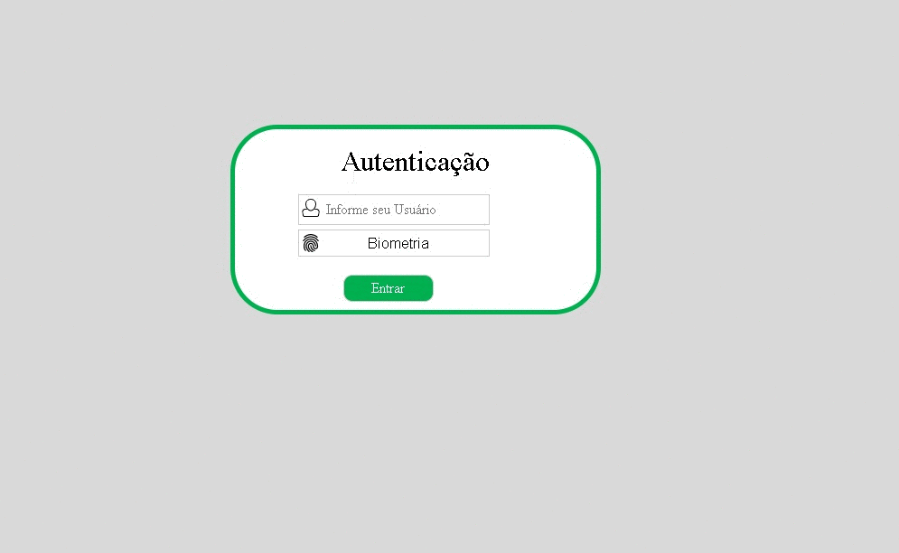

<h1 align="center">
    <a href="https://pt-br.reactjs.org/">🔑 Fingerprint Authentication</a>
</h1>

🐾 Biometric authentication application with images

<h4 align="center"> 
	🚧  Fingerprint Authentication 🐾 In progress...  🚧
</h4>

### Features

- [x] Backend
    - [x] Routes 
    - [x] Database
    - [x] CRUD users
    - [x] Fingerprint enhancement
    - [ ] List users 
- [x] Frontend
    - [x] Views
    - [ ] Logo
    
<h1 align="center">
  
</h1>

### 🎲 Run the Back End (server)

# Clone this repository
$ git clone <https://github.com/LucasNovais182/fingerprint-authentication>

# Access the project folder in the terminal/cmd
$ cd fingerprint-authentication

# Go to the server folder
$ cd autenticacao

# Install the virtual machine
$ py -m venv venv

# Activate the virtual machine
$ cd venv/scripts & activate

# Install Django
$ pip install django

# Deactivate and go back to server folder
$ deactivate & cd ../../

# Install Fingerprint Enhancer
$ pip install fingerprint_enhancer --user

# Run 
$ py manage.py runserver

# The server will start at port: 8000 - go to <http://localhost:8000> or go to DB admin <http://localhost:8000/admin>
User: lucas  
Password: 1234

### Pré-requisitos

Before you start, you need to have these tools installed on your machine:
[Git](https://git-scm.com), [Python](https://www.python.org/downloads/). 
Also, it’s good to have an editor to work with the code like [VSCode](https://code.visualstudio.com/)

### 🛠 Techs

Tools were used in building the application:

- [Django](https://www.djangoproject.com)
- [Sqlite](https://www.sqlite.org/index.html)
- [Fingerprint Enhancement Python](https://github.com/Utkarsh-Deshmukh/Fingerprint-Enhancement-Python)
